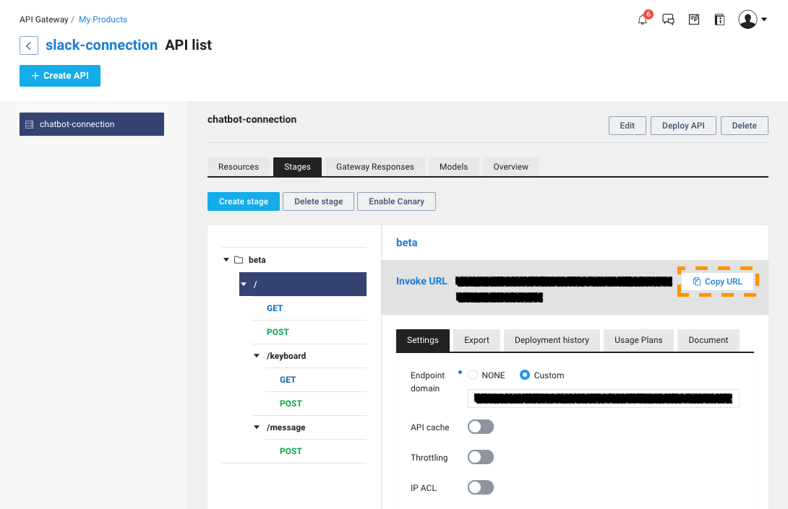
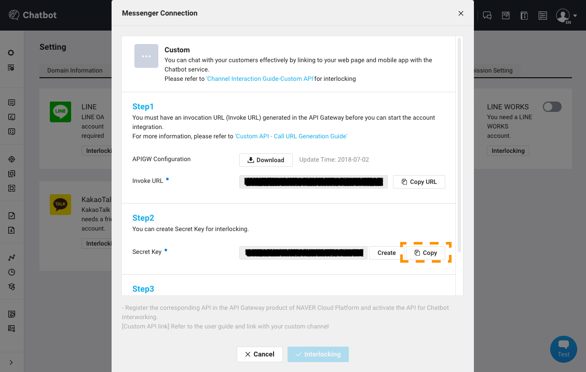
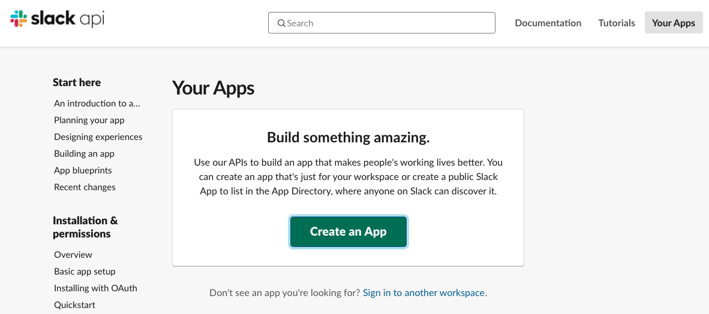
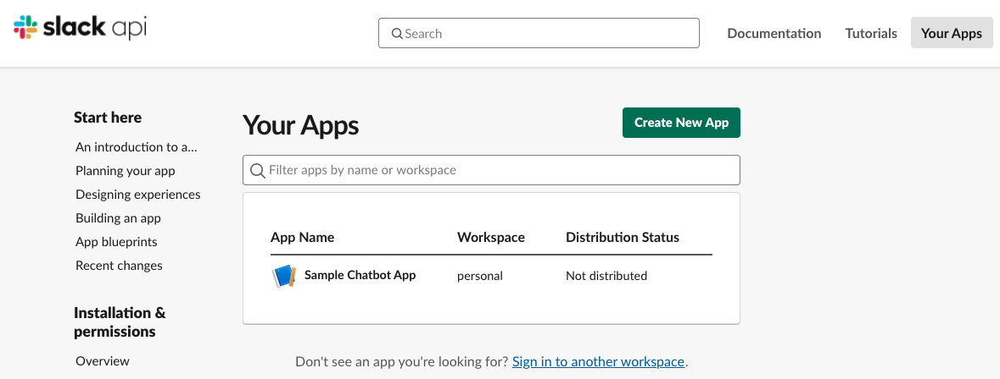
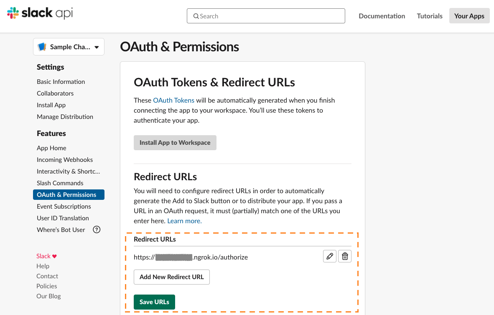
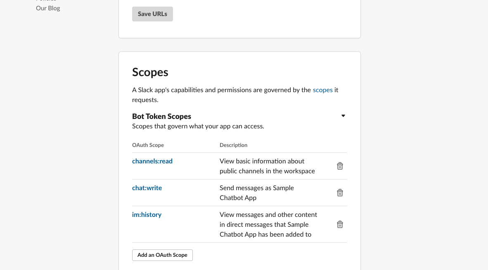
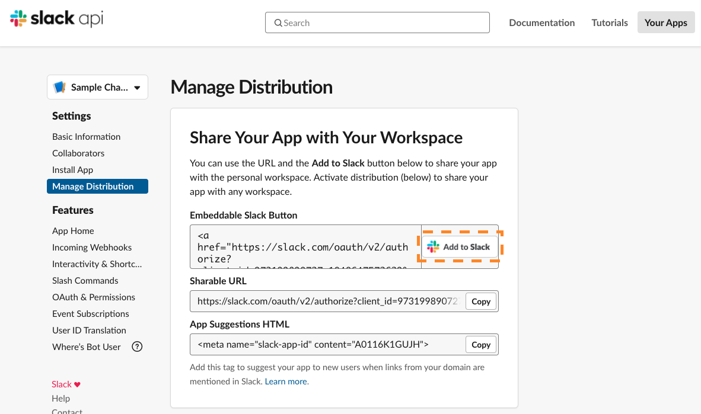
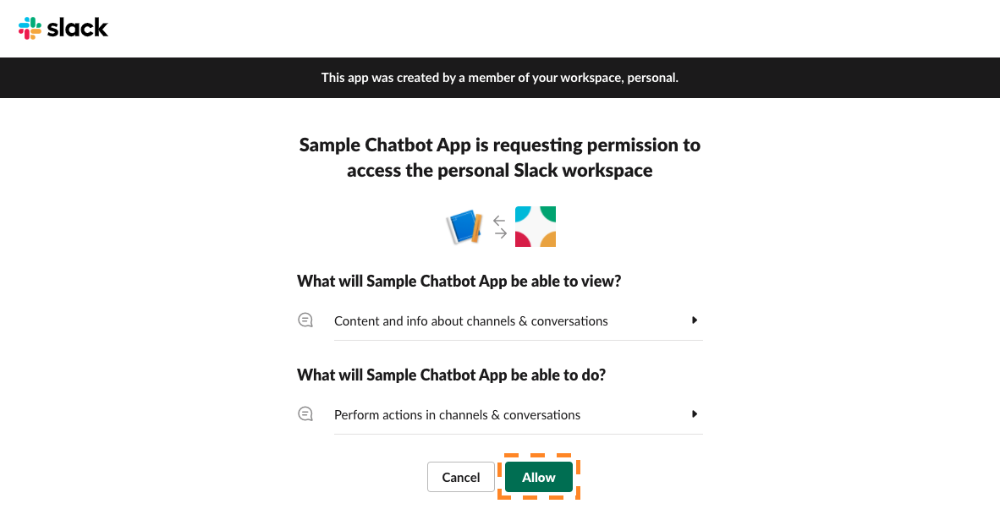
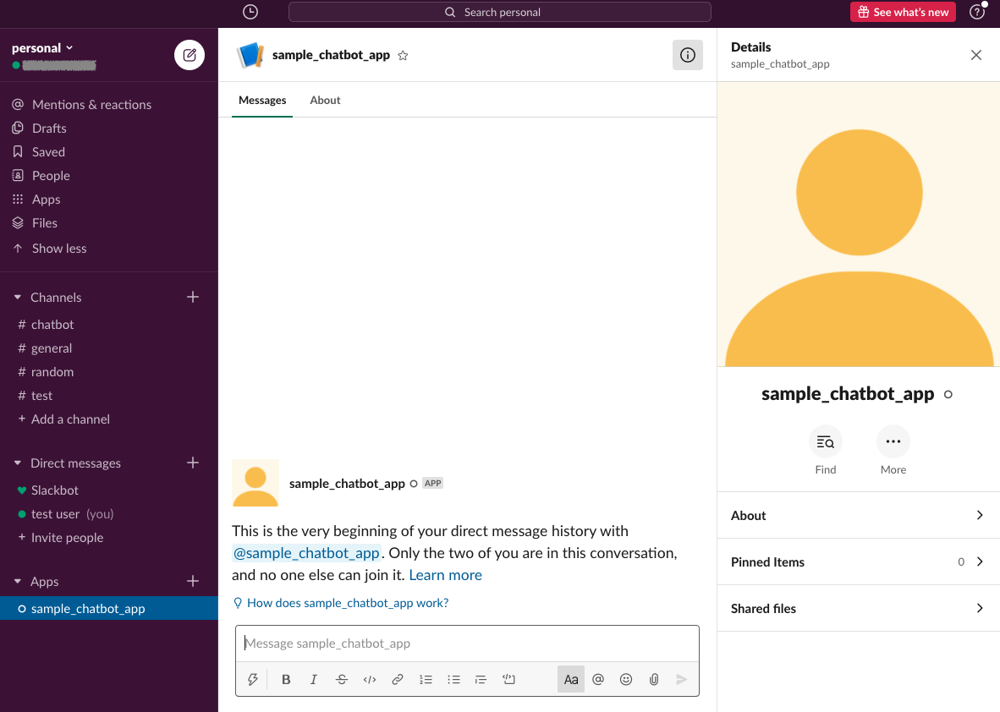

# How to connect Chatbot to Slack

[See Japanese README](README_ja.md)
## Note:
  #### 4/2/2020
  - Supporting chatbot message is only default reply.

## Requirements
- python since ver.3.6

### 1. Set chatbot service endpoint & secret key to this application.
1. Chatbot and API Gateway integration.
  - [Custom API - Create invoke URLs](https://docs.ncloud.com/en/chatbot/chatbot-2-5.html)
2. Set your chatbot service endpoint to CHATBOT_ENDPOINT that is environment variable. 
  
3. Set your secret key to CHATBOT_SECRET_KEY that is environment variable.
  

### 2. Create your slack app & set it's config to this application.
1. Open https://api.slack.com/apps & click [Create an App].
  
2. Enter new chatbot app name & select development workspace & click [Create App]
  
3. Set your config to environment variable. It can get from [App Credentials] under [Basic Information] page.
  - Set Client ID to SLACK_CLIENT_ID.
  - Set Client Secret to SLACK_CLIENT_SECRET.
  - Set Signing Secret to SLACK_SIGNING_SECRET.
  

### 3. Publish this application.
#### In this case, using ngrok.
1. Install ngrok.
  - https://ngrok.com/download
2. Start ngrok service.
```bash
ngrok http 3000
```
3. Copy published https domain.
  
4. Start this application.
```bash
# install requirements
pip install -r requirements.txt
# run application
python app.py
```

### 4. Set slack application config.
1. Open https://api.slack.com/apps. & click your slack application. & redirect to it's setting page.
  
2. Click [OAuth & Permissions] from [Features]. & set copied No.3-3 domain and authorization endpoint to [Redirect URLs] like an image.
  
3. Set application scope under [OAuth & Permissions] page. The setting is like an image.
  
4. Click [Event Subscriptions] from [Features]
  
5. enable [Enable Events]. & set copied No.3-3 domain and slack event endpoint to [Redirect URLs] like an image. & check Verified.
  
6. Click [Subscribe to bot events] & add Bot User Event. The setting is like an image. & Click [Save Changes]
  
7. Click [Manage Distribution] from [Settings]. & click [Add to Slack]. & redirect to access permission page.
  
8. Click [Allow]. & check [Auth complete!]
  
9. Open your workspace. & check existing your slack bot application.
  


### 5. Let's talk with slack bot
  

#### Reference
- https://github.com/stevengill/slack-python-oauth-example
