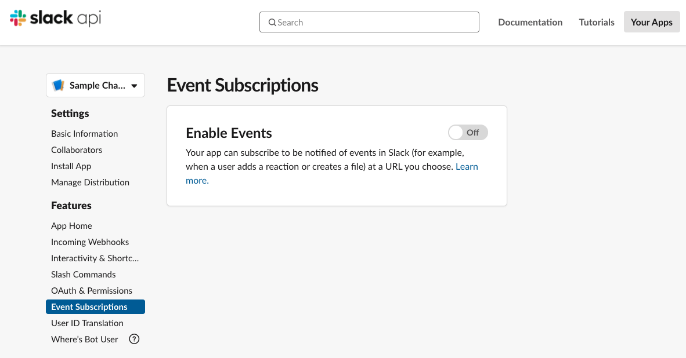

# チャットボットとSlackの連携方法

## Note:
  #### 4/2/2020
  - チャットボットの回答タイプ「基本回答」のみをサポートしています。

## Requirements
- python 3.X

### 1. チャットボットのエンドポイントとシークレットキーを設定
1. チャットボットとAPI Gatewayを連携
  - [Custom API-呼び出しＵＲＬ作成](https://docs.ncloud.com/ja/chatbot/chatbot-2-5.html)
2. 環境変数「CHATBOT_ENDPOINT」に項版1-1で連携したInvoke URLを設定
  
3. 環境変数「CHATBOT_SECRET_KEY」にチャットボットのシークレットキーを設定
  

### 2. Slackアプリケーション作成 & 設定情報取得
1. https://api.slack.com/apps を開いて、[Create an App]をクリック
  
2. アプリケーション名とワークスペースを設定し、[Create App]をクリック
  
3. 環境変数を下記のように設定 (環境変数は[Basic Information]ページの[App Credentials]から確認できます。)
  - Client IDを「SLACK_CLIENT_ID」へ設定
  - Client Secretを「SLACK_CLIENT_SECRET」へ設定
  - Signing Secretを「SLACK_SIGNING_SECRET」へ設定
  

### 3. アプリケーションを公開する
#### 本サンプルではngrokを使用してアプリケーションを公開します。
1. ngrokをインストール
  - https://ngrok.com/download
2. ngrok コマンドでサービスを起動
```bash
ngrok http 3000
```
3. サービス起動後に表示されたhttpsドメインをコピー
  
4. アプリケーションを起動
```bash
# 必要ライブラリをインストール
pip install -r requirements.txt
# アプリケーション起動
python app.py
```

### 4. Slackアプリケーション設定
1. https://api.slack.com/apps を開いて、作成したSlackアプリケーションをクリックし設定ページに移動
  
2. [OAuth & Permissions]ページの[Redirect URLs]へ、項版3-3でコピーしたドメインと認証用のエンドポイントを画像のように設定
  
3. [OAuth & Permissions]ページの[Scopes]へ、アプリケーションの権限を画像のように設定
  
4. [Event Subscriptions]ページを開く
  
5. [Enable Events]を有効にし、[Redirect URLs]へ項版3-3でコピーしたドメインとSlackイベントのエンドポイントを画像のように設定(エンドポイントが無事認識されるとVerifiedと表示される)
  
6. [Subscribe to bot events]へ画像のようにイベントを登録し、[Save Changes]をクリック
  
7. [Manage Distribution]ページの[Add to Slack]ボタンをクリックし、アクセス認証ページへ遷移する
  
8. [Allow]をクリックし、[Auth complete!]が表示されることを確認する
  
9. ワークスペースへ移動し、作成したSlackアプリケーションが存在することを確認する
  


### 5. チャットボットとSlack上で会話する
  

#### Refference
- https://github.com/stevengill/slack-python-oauth-example
